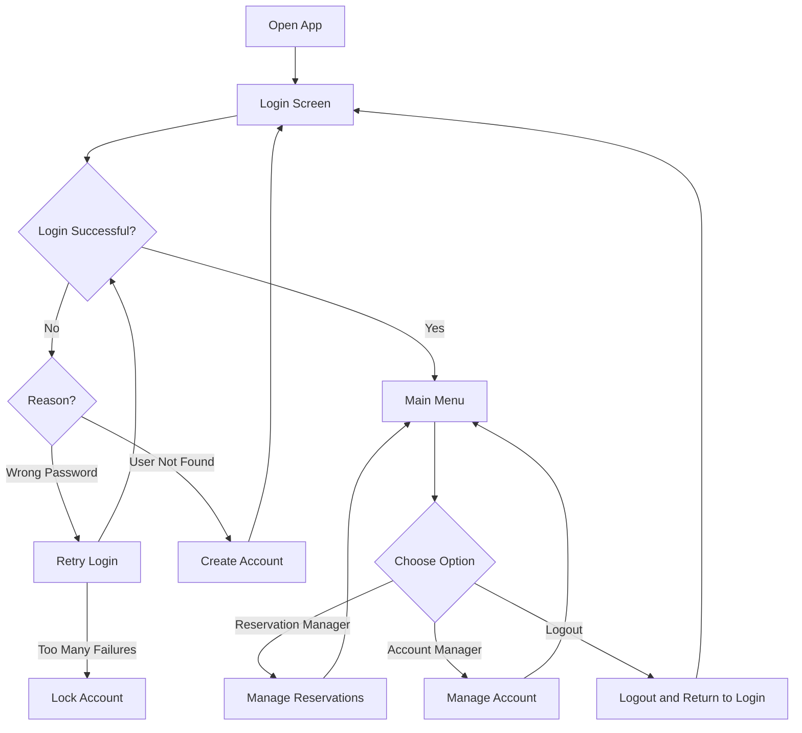

# User Reservation Management System

## About

**All Rentals In Kind** is a user reservation management system that aims to provide a user-friendly interface for managing user accounts and reservations. Users can create, login, update and delete their account profiles, then view, add and modify their reservations via our management system.

## Features

- User authentication (login)
- View current reservations
- Make new reservations based on recommendations
- Delete existing reservations
- View and update account details:
  - Username
  - Email
  - Password
  - Preferences
- Delete user account
- Logout functionality
- **AI-powered property search assistance** using OpenRouter/OpenAI API

## How We Recommend

The system includes a recommendation engine that suggests properties based on user preferences and requirements. Here's an overview:

- **Property Database**: Properties which may be recommended will be saved in JSON file, our management system parses them as a list of `Property` objects, or a DataFrame.
- **User Requirements**: Users are needed to specify location, group size, travel dates, budget, features, environment, and tags.
- **Filtering**:
  - Location, availability, and capacity are hard requirements. If a property does not match these three conditions, it will not be recommended.
  - We will calculate a score based on the weights defined by users for the remaining factors, includes:
    - Budget compatibility
    - Environmental match
    - Features overlap
    - Tags overlap
- **Ranking**: Top 10 recommendations are returned

This process helps users find the most suitable properties aligned with their preferences and constraints.

## AI-Powered Property Search Assistance (`llm.py`)

The `llm.py` script integrates with an LLM API (gpt-4o-mini via OpenRouter) to interpret natural language user requests into structured search parameters. Here's how it works:

- **User Prompt**: Asks the user to describe the desired property in natural language.
- **API Interaction**: Sends the prompt to the LLM API with a system prompt emphasizing output format.
- **Response Parsing**: Attempts to evaluate the LLM's output into a Python dictionary containing fields such as:
  - `location`, `environment`, `group_size`, `budget`, `price_min`, `price_max`, `features`, `tags`, `start_date`, `end_date`.
- **Field Completion**:
  - If the LLM response lacks certain fields, the script interactively prompts the user for missing information.
  - Parses dates in various formats and expands the travel date range.
- **Output**: Returns a structured Python dictionary of search criteria, which can be used for property recommendation.

This AI-assisted process simplifies complex user inputs and enhances the search experience by understanding natural language descriptions.

## Control Flow Chart

